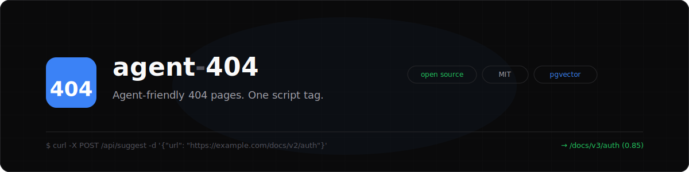

# agent-404

<p align="center">
  
</p>

[](LICENSE)
[](https://github.com/bharath31/agent-404/actions)
[](https://vercel.com/new/clone?repository-url=https%3A%2F%2Fgithub.com%2Fbharath31%2Fagent-404&env=POSTGRES_URL,EMBEDDING_API_KEY,CRON_SECRET&envDescription=POSTGRES_URL%3A%20Neon%2FVercel%20Postgres%20connection%20string.%20EMBEDDING_API_KEY%3A%20For%20semantic%20embeddings%20(optional).%20CRON_SECRET%3A%20Bearer%20token%20for%20cron.&project-name=agent-404&repository-name=agent-404)

Make your 404 pages agent-friendly. When AI agents and crawlers hit a dead link, they give up or hallucinate. **agent-404** returns structured suggestions of the next best pages — so agents recover gracefully.

One script tag. That's it.

```html
<script
  src="https://agent404.dev/agent-404.min.js"
  data-site-id="your-site-id"
  data-api-key="your-api-key"
  defer
></script>
```

## How it works

1. **On live pages** — the script beacons page metadata (URL, title, headings) to build your site index
2. **On 404 pages** — the script fetches ranked suggestions and injects them as:
   - A human-readable suggestion list
   - A `schema.org/ItemList` JSON-LD block that agents already understand

### 404 Detection

The script detects 404 pages using (in order):
- `data-404-selector` — CSS selector you provide (e.g. `".not-found"`)
- `<meta name="agent-404:status" content="404">` — meta tag
- Page title containing "404" or "not found"

### Ranking — 4 signals

Suggestions are ranked by a weighted combination of four signals:

| Signal | Weight | What it catches |
|---|---|---|
| **Path segment similarity** | 0.35 | Jaccard on URL segments, version-tolerant (`v2` → `v3` = partial match) |
| **Semantic embeddings** | 0.30 | Cosine similarity on 256d vectors — catches zero-lexical-overlap rewrites (e.g. `/docs/authentication` → `/guides/security/oauth`) |
| **Levenshtein distance** | 0.20 | Typos and minor path differences |
| **Keyword overlap** | 0.15 | Words from dead URL matched against page titles and headings |

Embeddings are generated via any OpenAI-compatible API (default: OpenRouter with `openai/text-embedding-3-small`). Set `EMBEDDING_API_KEY` to enable; if missing or the API is down, the system falls back to 3-signal matching with the original weights (0.50 / 0.30 / 0.20).

#### How embeddings work

- **On write** — when a page is registered (beacon or sitemap crawl), its URL path + title + description are embedded and stored as a `vector(256)` column in Postgres (pgvector)
- **On suggest** — the dead URL is embedded and used as a vector pre-filter (`ORDER BY embedding <=> query LIMIT 20`) to pull the top 20 candidates, which are then re-ranked with all 4 signals
- **Backfill** — the daily cron job generates embeddings for any pages that are missing them (in batches of 100)
- **Config** — `EMBEDDING_API_URL` and `EMBEDDING_MODEL` env vars let you point at any provider (OpenAI, Azure, local)

## API

### Register a site

```bash
curl -X POST https://agent404.dev/api/sites \
  -H "Content-Type: application/json" \
  -d '{"domain": "example.com"}'
```

Returns `siteId` and `apiKey`. The sitemap is crawled automatically on registration.

### Beacon a page (client script does this automatically)

```bash
curl -X POST https://agent404.dev/api/register \
  -H "Content-Type: application/json" \
  -H "x-api-key: your-api-key" \
  -d '{"url": "https://example.com/docs/auth", "title": "Auth Guide", "headings": ["OAuth", "API Keys"]}'
```

### Get suggestions for a dead URL

```bash
curl -X POST https://agent404.dev/api/suggest \
  -H "Content-Type: application/json" \
  -H "x-api-key: your-api-key" \
  -d '{"url": "https://example.com/docs/v2/auth"}'
```

Response:
```json
{
  "deadUrl": "https://example.com/docs/v2/auth",
  "suggestions": [
    { "url": "https://example.com/docs/v3/auth", "title": "Authentication Guide", "score": 0.85, "matchType": "moved" }
  ],
  "jsonLd": { "@context": "https://schema.org", "@type": "WebPage", "..." : "..." }
}
```

## Self-hosting

### One-click deploy

[](https://vercel.com/new/clone?repository-url=https%3A%2F%2Fgithub.com%2Fbharath31%2Fagent-404&env=POSTGRES_URL,EMBEDDING_API_KEY,CRON_SECRET&envDescription=POSTGRES_URL%3A%20Neon%2FVercel%20Postgres%20connection%20string.%20EMBEDDING_API_KEY%3A%20For%20semantic%20embeddings%20(optional%20but%20recommended).%20CRON_SECRET%3A%20Bearer%20token%20for%20the%20daily%20cron%20job.&project-name=agent-404&repository-name=agent-404)

Click the button above and provide the required environment variables:
- **`POSTGRES_URL`** — Connection string for a Neon or Vercel Postgres database
- **`EMBEDDING_API_KEY`** — For semantic embeddings (optional but recommended, ~$0.02/1M tokens)
- **`CRON_SECRET`** — Bearer token to authenticate the daily cron job

After deploying, run the migration:
```bash
npm run db:migrate
```

### Manual setup

```bash
# 1. Fork and clone the repo
git clone https://github.com/bharath31/agent-404.git
cd agent-404
npm install

# 2. Create a Postgres database
#    Option A: Vercel Dashboard → Storage → Create Postgres
#    Option B: Create a Neon database at neon.tech

# 3. Set environment variables
#    Create .env.local with:
#      POSTGRES_URL=postgres://...
#      EMBEDDING_API_KEY=sk-...      (optional)
#      CRON_SECRET=your-secret

# 4. Run migrations
npm run db:migrate

# 5. Local dev
npm run dev

# 6. Build client script
npm run build:script

# 7. Deploy
vercel --prod
```

## Stack

- **Runtime**: Vercel Edge Functions (Hono)
- **Database**: Vercel Postgres (Neon) + pgvector
- **Embeddings**: OpenAI `text-embedding-3-small` (256d)
- **Client**: Vanilla JS, <3KB
- **Indexing**: Sitemap.xml crawl + client-side beacons

## License

MIT
