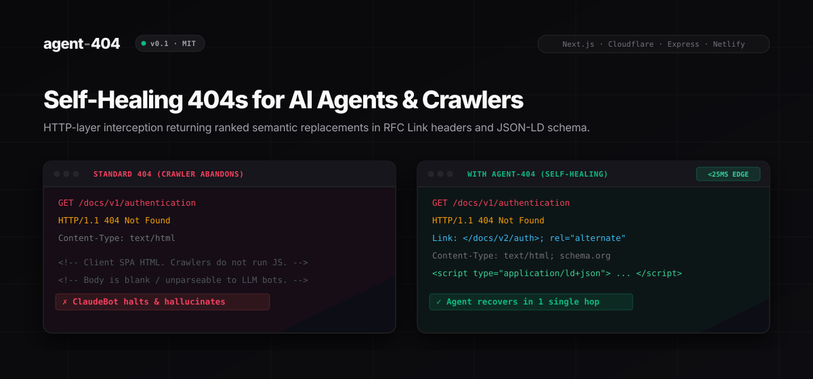

# agent-404

<p align="center">
  
</p>

[](LICENSE)
[](https://github.com/bharath31/agent-404/actions)
[](https://vercel.com/new/clone?repository-url=https%3A%2F%2Fgithub.com%2Fbharath31%2Fagent-404&env=DATABASE_URL,EMBEDDING_API_KEY,CRON_SECRET,AUTH0_DOMAIN,AUTH0_CLIENT_ID,AUTH0_CLIENT_SECRET,AUTH0_SESSION_ENCRYPTION_KEY,BASE_URL&envDescription=DATABASE_URL%3A%20Neon%20Postgres.%20Auth0%20passwordless%20email%20OTP%20for%20the%20dashboard.&project-name=agent-404&repository-name=agent-404)
[](https://deploy.workers.cloudflare.com/?url=https://github.com/bharath31/agent-404)

Make your 404 pages agent-friendly. When AI agents and crawlers hit a dead link, they give up or hallucinate. **agent-404** puts ranked suggestions in the **404 response itself** — HTML, JSON-LD, and `Link` headers — so agents that never run JavaScript can still recover.

GPTBot, ClaudeBot, and PerplexityBot do not execute JS. The script tag is the zero-config path for browsers and browser-driving agents. Middleware is the path that actually reaches crawlers.

## Install (HTTP layer — recommended)

Intercept 404s before the response is written. `curl -A ClaudeBot https://yoursite/dead-link` should return **404** with suggestions in the body.

```ts
// Next.js middleware.ts
import { agent404 } from "./adapters/next";

export const middleware = agent404({
  apiKey: process.env.AGENT404_PUBLIC_KEY!,
});
```

Same helper exists for Express (`recoverExpress404` from `adapters/express.ts`), Cloudflare Workers (`agent404Worker`), Netlify Edge (`agent404Netlify`), and nginx (`adapters/nginx.md`). Shared logic lives in `adapters/core.ts`: `recover404()` injects JSON-LD, a suggestion list, `Link` alternates, and honors `Accept: application/json` (still a 404, with `Vary: Accept`).

App Router `not-found.tsx` must return JSX, not a `Response`. Keep `middleware.ts` for crawlers (Link headers + JSON Accept). In `not-found.tsx`, call `notFoundSuggestions()` from `adapters/next.ts` to render the same links for humans.

Suggestions in the raw 404 body are visible to any `curl`, not only JS clients. The origin probe and the suggestion API each use a 2.5s timeout by default.

## Zero-config script (browsers only)

Reaches humans and agents that execute JavaScript. It does **not** reach GPTBot / ClaudeBot / PerplexityBot.

```html
<script
  src="https://www.agent404.dev/agent-404.min.js"
  data-site-id="your-site-id"
  data-public-key="your-public-key"
  defer
></script>
```

The public key is **read-only** (`/api/suggest`). Keep the secret write key off the page — it is the only credential that can call `/api/register` and `/api/analyze`. **Indexing for new installs is sitemap-driven:** after you prove ownership, we crawl `sitemap.xml` (and re-crawl daily). The script tag with `data-public-key` only serves 404 suggestions; it does not beacon writes. Existing installs that still send `data-api-key` continue to work for suggestions (the old key is treated as the secret key). Browser requests that send a secret key plus an `Origin` header are rejected so the secret cannot be used from page HTML.

`Origin` on `/api/suggest` stops other sites' **browser** JavaScript from using your public key. Non-browser clients can set `Origin` freely — it is not a substitute for keeping the secret key off the page.

Use `https://www.agent404.dev` (not the apex). `agent404.dev` 307-redirects to `www`, and a CORS preflight that receives a redirect is a hard failure — the script will not register pages or render suggestions.

Self-hosters can override the API origin with `data-api-base="https://your-origin.example"`.

## How it works

1. **At the HTTP layer** — middleware rewrites a 404 **before** the body is sent: suggestion list, `schema.org/ItemList` JSON-LD, and `Link` headers. Crawlers that never run JS still see them. `Accept: application/json` returns the same payload as `/api/suggest` with status 404.
2. **Index** — after domain verification, a sitemap crawl (and the daily cron) registers pages. Do not put the secret key in HTML.
3. **In the browser (optional)** — the script tag injects suggestions for humans / JS-capable agents.

Sibling: [agent404-server](https://github.com/kormco/agent404-server) by [@kormco](https://github.com/kormco) for webserver-layer interception.

### Ranking — 4 signals

Suggestions are ranked by a weighted combination of four signals:

| Signal | Weight | What it catches |
|---|---|---|
| **Path segment similarity** | 0.35 | Jaccard on URL segments, version-tolerant (`v2` → `v3` = partial match) |
| **Semantic embeddings** | 0.30 | Cosine similarity on 256d vectors — catches zero-lexical-overlap rewrites (e.g. `/docs/authentication` → `/guides/security/oauth`) |
| **Levenshtein distance** | 0.20 | Typos and minor path differences |
| **Keyword overlap** | 0.15 | Words from dead URL matched against page titles and headings |

Embeddings are generated via any OpenAI-compatible API (default: OpenRouter with `openai/text-embedding-3-small`). Set `EMBEDDING_API_KEY` to enable; if missing or the API is down, the system falls back to 3-signal matching with the original weights (0.50 / 0.30 / 0.20).

#### How embeddings work

- **On write** — when a page is registered (beacon or sitemap crawl), its URL path + title + description are embedded and stored as a `vector(256)` column in Postgres (pgvector)
- **On suggest** — the dead URL is embedded and used as a vector pre-filter (`ORDER BY embedding <=> query LIMIT 20`) to pull the top 20 candidates, which are then re-ranked with all 4 signals
- **Backfill** — the daily cron job generates embeddings for any pages that are missing them (in batches of 100)
- **Config** — `EMBEDDING_API_URL` and `EMBEDDING_MODEL` env vars let you point at any provider (OpenAI, Azure, local)

## Script-tag 404 detection

When using the optional browser snippet:
- `data-404-selector` — CSS selector you provide (e.g. `".not-found"`)
- `<meta name="agent-404:status" content="404">` — meta tag
- Page title containing "404" or "not found"

## API

### Register a site

```bash
curl -X POST https://www.agent404.dev/api/sites \
  -H "Content-Type: application/json" \
  -d '{"domain": "example.com"}'
```

Returns `id`, `apiKey` (secret, server-side), `publicKey` (safe for HTML), and a `verificationToken`. The site **does not serve suggestions** until you prove domain ownership:

```bash
# DNS TXT _agent404.example.com = <verificationToken>
# or https://example.com/.well-known/agent-404.txt containing the token

curl -X POST https://www.agent404.dev/api/sites/<id>/verify
```

If someone else registered your domain, `POST /api/sites/reclaim` then `POST /api/sites/reclaim/complete` after proving ownership. **Unverified** (squatted-before-proof) domains complete immediately. **Already-verified** sites have a 24-hour cooling-off period and require `{ "confirm": true }` so a brief DNS hijack cannot silently rotate live keys. Rows that existed before this migration were grandfathered as verified — reclaim is the path for a real owner; this is not an automatic re-check.

Sitemap crawl runs after verification, not at create time.

### Verify the install

```bash
curl https://www.agent404.dev/api/install/status \
  -H "x-api-key: your-secret-key"
```

`installVerified` is true only after at least one page has been indexed. An empty index is a failure, not a quiet success.

### Beacon a page (secret key only)

```bash
curl -X POST https://www.agent404.dev/api/register \
  -H "Content-Type: application/json" \
  -H "x-api-key: your-secret-key" \
  -d '{"url": "https://example.com/docs/auth", "title": "Auth Guide", "headings": ["OAuth", "API Keys"]}'
```

URLs whose host is not the registered domain (or a subdomain) are rejected.

### Get suggestions for a dead URL

```bash
curl -X POST https://www.agent404.dev/api/suggest \
  -H "Content-Type: application/json" \
  -H "Origin: https://example.com" \
  -H "x-api-key: your-public-key" \
  -d '{"url": "https://example.com/docs/v2/auth"}'
```

Response:
```json
{
  "deadUrl": "https://example.com/docs/v2/auth",
  "suggestions": [
    { "url": "https://example.com/docs/v3/auth", "title": "Authentication Guide", "score": 0.85, "matchType": "moved" }
  ],
  "jsonLd": { "@context": "https://schema.org", "@type": "WebPage", "..." : "..." }
}
```

## Self-hosting

### One-click deploy

**Vercel** (recommended)

[](https://vercel.com/new/clone?repository-url=https%3A%2F%2Fgithub.com%2Fbharath31%2Fagent-404&env=DATABASE_URL,EMBEDDING_API_KEY,CRON_SECRET,AUTH0_DOMAIN,AUTH0_CLIENT_ID,AUTH0_CLIENT_SECRET,AUTH0_SESSION_ENCRYPTION_KEY,BASE_URL&envDescription=DATABASE_URL%3A%20Neon%20Postgres.%20Auth0%20passwordless%20email%20OTP%20for%20the%20dashboard.&project-name=agent-404&repository-name=agent-404)

**Cloudflare Workers**

[](https://deploy.workers.cloudflare.com/?url=https://github.com/bharath31/agent-404)

After deploying, set your secrets:
```bash
wrangler secret put DATABASE_URL
wrangler secret put CRON_SECRET
wrangler secret put EMBEDDING_API_KEY  # optional
```

### Environment variables

| Variable | Required | Description |
|---|---|---|
| `DATABASE_URL` | Yes | Neon Postgres connection string |
| `CRON_SECRET` | Yes | Bearer token for the daily cron job |
| `AUTH0_DOMAIN` | Yes (dashboard) | Auth0 tenant domain |
| `AUTH0_CLIENT_ID` | Yes (dashboard) | Regular Web App client ID |
| `AUTH0_CLIENT_SECRET` | Yes (dashboard) | Regular Web App client secret |
| `AUTH0_SESSION_ENCRYPTION_KEY` | Yes (dashboard) | 32+ character cookie encryption key |
| `BASE_URL` | Yes (dashboard) | App origin, e.g. `https://www.agent404.dev` |
| `EMBEDDING_API_KEY` | No | For semantic embeddings (~$0.02/1M tokens) |
| `EMBEDDING_API_URL` | No | Custom embedding API endpoint |
| `EMBEDDING_MODEL` | No | Custom embedding model name |

Owner sign-in is **passwordless email OTP only** (Auth0 connection `email`). Enable Authentication → Passwordless → Email on a Regular Web App. Callback: `https://www.agent404.dev/auth/callback` and `http://localhost:3000/auth/callback`. Logout URLs: the same origins.

After deploying, run the migration:
```bash
npm run db:migrate
```

### Manual setup

```bash
# 1. Fork and clone the repo
git clone https://github.com/bharath31/agent-404.git
cd agent-404
npm install

# 2. Create a Neon database at neon.tech

# 3. Set environment variables
#    Create .env.local with:
#      DATABASE_URL=postgres://...
#      AUTH0_DOMAIN=your-tenant.auth0.com
#      AUTH0_CLIENT_ID=...
#      AUTH0_CLIENT_SECRET=...
#      AUTH0_SESSION_ENCRYPTION_KEY=...  (32+ chars)
#      BASE_URL=http://localhost:3000
#      EMBEDDING_API_KEY=sk-...      (optional)
#      CRON_SECRET=your-secret

# 4. Run migrations
npm run db:migrate

# 5. Local dev
npm run dev           # Vercel
npm run dev:cf        # Cloudflare Workers

# 6. Build client script
npm run build:script

# 7. Deploy
npm run deploy        # Vercel
npm run deploy:cf     # Cloudflare Workers
```

## Stack

- **Runtime**: Vercel Node.js Serverless Functions / Cloudflare Workers (Hono)
- **Database**: Neon Postgres + pgvector
- **Embeddings**: OpenAI `text-embedding-3-small` (256d)
- **Client**: Vanilla JS, <3KB
- **Indexing**: Sitemap.xml crawl + client-side beacons

## License

MIT
